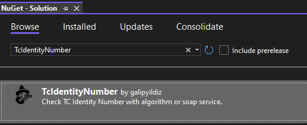

<p align="center">
<b>Check TC Identity Number</b>
<br />

<br />
Verify TC Identity Number the easiest way
</p>

----
### How to use?
- Install nuget package
  - Package Manager Console
    ```
      Install-Package TcIdentityNumber -Version 1.0.0 
    ``` 
  - Nuget Package Solution
    <br />
    
    <br />
    Select this package and install to your project.
- Enjoy your verify identity number 
    - .Net 6.0 Console Application
    ```cs
    using TCIdentityNumber;

    long identityNumber = 1111111111;
    Console.WriteLine(identityNumber.IsIdentityNumberCorrect());
    Console.WriteLine(await identityNumber.IsIdentityNumberCorrectAsync("Ali", "Veli", 2022));
    ```
    - Output
    ```
    False
    False
    ```

**Note:** If you enter the correct information, you can get the correct results. :smile:
